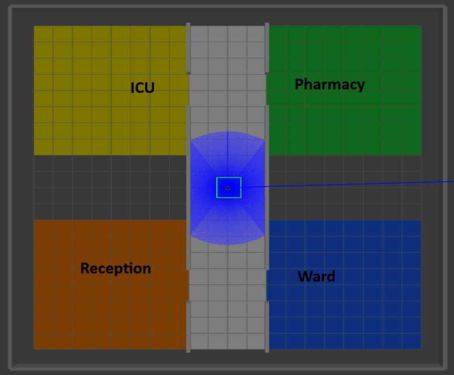

<div align="center">


# 🏥 VRC-7 — Voice Recognition Control for TurtleBot3

**AI-powered voice control system for autonomous hospital delivery robot simulation**

[](https://docs.ros.org/en/humble/)
[](https://www.python.org/)
[](https://groq.com)
[](http://gazebosim.org/)
[](LICENSE)

*Semester 3 | Winter 2025/26 | Autonomous Intelligent Systems*
*Frankfurt University of Applied Sciences | </br >Supervised by Prof. Dr. Peter Nauth*

</div>

---

## 📋 Table of Contents

- [Overview](#overview)
- [Demo](#demo)
- [System Architecture](#system-architecture)
- [Features](#features)
- [Prerequisites](#prerequisites)
- [Installation](#installation)
- [Running the Project](#running-the-project)
- [Voice Commands](#voice-commands)
- [World Layout](#world-layout)
- [How It Works](#how-it-works)
- [Project Structure](#project-structure)
- [File Descriptions](#file-descriptions)
- [Known Limitations](#known-limitations)
- [Contributors](#contributors)
- [Acknowledgements](#acknowledgements)

---

## Overview

**VRC-7** is a voice-controlled hospital delivery robot built on **ROS2 Humble** and **Gazebo Classic**. The system leverages **Groq AI** — specifically Whisper large-v3-turbo for speech transcription and LLaMA 3.3 70B for natural language understanding — to interpret voice commands in real time and navigate a **TurtleBot3 Burger** robot through a simulated hospital environment with four zones: ICU, Pharmacy, Reception, and Ward.

A key design goal was robustness to **accented speech and background noise**. The system uses a dual-layer NLU pipeline: a local regex engine handles standard commands with zero API calls, while Groq LLaMA 3.3 70B handles garbled or accented speech that the local engine cannot interpret. Navigation uses **live odometry feedback** and a structured 4-step room-exit routing strategy to avoid wall collisions.

---

## Demo

<!-- PLACEHOLDER: Record a 60-90 second demo video showing:
     1. Robot spawning at (0,0)
     2. "go to pharmacy" — navigates to green block
     3. "go to ICU" — navigates from pharmacy to yellow block
     4. "turn right" + "go forward" — manual control
     5. "stop"
     Save as assets/demo.gif -->


> 💡 The robot understands accented and noisy speech through Groq AI (Whisper + LLaMA 3.3 70B). Commands like *"farmasi"*, *"take lift"*, and *"donor"* are correctly interpreted as pharmacy, turn left, and turn around respectively.

---

## System Architecture

```
┌──────────────────────────────────────────────────────────────┐
│                        VOICE INPUT                           │
│                 Microphone → WSLg PulseAudio                 │
└───────────────────────────┬──────────────────────────────────┘
                            │  raw audio
                            ▼
┌──────────────────────────────────────────────────────────────┐
│                      AUDIO PIPELINE                          │
│   sounddevice InputStream → Energy VAD → Audio Queue         │
│   (Continuous callback stream — never drops audio)           │
└───────────────────────────┬──────────────────────────────────┘
                            │  speech chunks (1.5s)
                            ▼
┌──────────────────────────────────────────────────────────────┐
│                      TRANSCRIPTION                           │
│   Primary : Groq Whisper large-v3-turbo (cloud, accent-aware)│
│   Fallback: faster-whisper base         (local, offline)     │
└───────────────────────────┬──────────────────────────────────┘
                            │  text
                            ▼
┌──────────────────────────────────────────────────────────────┐
│            NATURAL LANGUAGE UNDERSTANDING (NLU)              │
│   Layer 1: Local regex engine  (instant, zero API calls)     │
│   Layer 2: Groq LLaMA 3.3 70B (accents, noise, complex cmds) │
└───────────────────────────┬──────────────────────────────────┘
                            │  JSON command
                            ▼
┌──────────────────────────────────────────────────────────────┐
│                   ROBOT CONTROLLER (ROS2)                    │
│   Navigate │ Move Continuous │ Timed Move │Cardinal Direction│
│   /cmd_vel publisher — odometry + LiDAR feedback             │
└───────────────────────────┬──────────────────────────────────┘
                            │  /cmd_vel (Twist)
                            ▼
┌──────────────────────────────────────────────────────────────┐
│             GAZEBO SIMULATION — TurtleBot3 Burger            │
│       /odom (Odometry) ←── Robot ──→ /scan (LiDAR)           │
└──────────────────────────────────────────────────────────────┘
```

---

## Features

| Feature | Description |
|---------|-------------|
| 🎤 **Continuous Listening** | Callback-based audio stream — never pauses, never drops commands |
| 🧠 **AI-Powered NLU** | Groq LLaMA 3.3 70B interprets accented and noisy speech |
| 🗺️ **Smart Navigation** | Live odometry-based routing through corridor gaps |
| 🔄 **Dual NLU Fallback** | Local regex → Groq AI, graceful degradation on quota |
| 🛡️ **Wall Detection** | LiDAR-based obstacle stop for manual movement |
| 🔁 **Wall Recovery** | Auto back-up and retry on navigation wall hit |
| 📍 **Room-Exit Routing** | Always exits through correct corridor gap before navigating |
| 🧭 **Cardinal Directions** | `go east / north / southwest for 3 meters` |
| 🔀 **Compound Commands** | `turn right and go forward` executes sequentially |
| ⏱️ **Fixed Turns** | Exact 90° / 180° / 360° rotations using angular timing |

---

## Prerequisites

| Requirement | Version |
|-------------|---------|
| OS | Ubuntu 22.04 (native or WSL2) |
| ROS2 | Humble Hawksbill |
| Gazebo | Classic 11 |
| Python | 3.10+ |
| TurtleBot3 | Humble packages |

### Python Dependencies

```bash
pip install groq faster-whisper sounddevice soundfile numpy torch
```

### Groq API Key

A free API key is required for Groq Whisper transcription and LLaMA NLU.
Get one at [console.groq.com](https://console.groq.com).

> **Note:** The Groq free tier allows ~30 requests/minute. The system minimises API calls — local NLU handles standard commands without any API usage, and Groq is only called for unclear or accented speech.

---

## Installation

```bash
# 1. Create ROS2 workspace
mkdir -p ~/turtlebot_vrc_ws/src
cd ~/turtlebot_vrc_ws/src

# 2. Clone the repository
git clone https://github.com/Mprabhu26/turtlebot_vrc.git

# 3. Install TurtleBot3 ROS2 packages
sudo apt update
sudo apt install ros-humble-turtlebot3 ros-humble-turtlebot3-gazebo

# 4. Install Python dependencies
pip install groq faster-whisper sounddevice soundfile numpy torch

# 5. Build the package
cd ~/turtlebot_vrc_ws
source /opt/ros/humble/setup.bash
colcon build --packages-select turtlebot_vrc
source install/setup.bash

# 6. Set environment variables permanently
echo 'export TURTLEBOT3_MODEL=burger' >> ~/.bashrc
echo 'export GROQ_API_KEY=your_key_here' >> ~/.bashrc
echo 'source /opt/ros/humble/setup.bash' >> ~/.bashrc
echo 'source ~/turtlebot_vrc_ws/install/setup.bash' >> ~/.bashrc
source ~/.bashrc
```

### WSL2 / WSLg Audio Setup

WSL2 requires PulseAudio to be routed through WSLg. Run this once after every `wsl --shutdown`:

```bash
rm -rf /run/user/1000/pulse
export PULSE_SERVER=unix:/mnt/wslg/PulseServer
```

---

## Running the Project

### ▶ One Command Launch *(Recommended)*

```bash
chmod +x ~/turtlebot_vrc_ws/src/turtlebot_vrc/start_hospital.sh
~/turtlebot_vrc_ws/src/turtlebot_vrc/start_hospital.sh
```

This single command sources ROS2, launches Gazebo with the hospital world, waits for it to fully load, and then starts the voice control node automatically. When you see `Microphone active — speak your command` in the terminal, the system is ready.

---

### 🔧 Manual Launch *(For Debugging)*

> Use manual launch when you want to see Gazebo and voice control logs in separate terminals, or when you need to restart one component without stopping the other.

**Terminal 1 — Start Gazebo simulation**
```bash
source /opt/ros/humble/setup.bash
source ~/turtlebot_vrc_ws/install/setup.bash
export TURTLEBOT3_MODEL=burger
ros2 launch turtlebot_vrc hospital.launch.py
```

**Terminal 2 — Start voice control** *(open a new terminal, wait for Gazebo to fully load first)*
```bash
source /opt/ros/humble/setup.bash
source ~/turtlebot_vrc_ws/install/setup.bash
ros2 run turtlebot_vrc voice_control
```

---

## Voice Commands

> The AI interprets your **intent**, not just exact words. Commands work with accents, background noise, and natural variations.

### 🏥 Navigation
| Say | Action |
|-----|--------|
| `go to ICU` / `yellow room` / `intensive care` | Navigate to ICU (+6, +6) |
| `go to pharmacy` / `green room` / `medicine` | Navigate to Pharmacy (+6, -6) |
| `go to reception` / `orange room` / `front desk` | Navigate to Reception (-6, +6) |
| `go to ward` / `blue room` / `patient room` | Navigate to Ward (-6, -6) |
| `go to center` / `home` / `reset` / `origin` | Navigate to center (0, 0) |

### 🕹️ Manual Movement
| Say | Action |
|-----|--------|
| `go forward` / `advance` / `ahead` | Move forward continuously until stop |
| `go back` / `reverse` / `retreat` | Move backward continuously until stop |
| `stop` / `halt` / `freeze` / `cancel` | Stop all movement immediately |

### 🔄 Turns
| Say | Action |
|-----|--------|
| `turn right` / `take right` / `go right` | Rotate exactly 90° clockwise |
| `turn left` / `take left` / `go left` | Rotate exactly 90° counter-clockwise |
| `turn around` / `180` / `u-turn` | Rotate exactly 180° |
| `spin` / `360` | Full 360° rotation |

### 🧭 Cardinal Directions
| Say | Action |
|-----|--------|
| `go east` / `go west` / `go north` / `go south` | Face direction and move continuously |
| `go east for 3 meters` | Face east and move exactly 3 metres |
| `go northeast` / `go southwest` | Face diagonal direction and move |

### 🔀 Compound Commands
| Say | Action |
|-----|--------|
| `turn right and go forward` | Rotate 90° then move forward |
| `turn left then go forward` | Rotate 90° left then move forward |

---

## World Layout




The simulated hospital consists of a central east-west corridor with 4 colour-coded rooms. The corridor walls at y=±2 have entry gaps at x=±6 — the only way in and out of each room. The robot's navigation always routes through these gaps to avoid wall collisions.

| Room | Coordinates | Colour | Entry Gap |
|------|-------------|--------|-----------|
| ICU | (+6, +6) | 🟡 Yellow | East gap (x=+6) |
| Pharmacy | (+6, -6) | 🟢 Green | East gap (x=+6) |
| Reception | (-6, +6) | 🟠 Orange | West gap (x=-6) |
| Ward | (-6, -6) | 🔵 Blue | West gap (x=-6) |

```

```
*Robot spawns at (0, 0) facing EAST. Boundary walls at x=±11, y=±11.*

---

## How It Works

### 1. Audio Pipeline
The system uses a **callback-based `sounddevice.InputStream`** that runs on a dedicated thread, collecting audio samples continuously into a buffer. Every 1.5 seconds of audio is assembled into a chunk and placed in a processing queue. An **energy-based VAD** pre-filters silent chunks before transcription, reducing unnecessary API calls.

### 2. Transcription
Audio chunks are sent to **Groq Whisper large-v3-turbo** with two key settings: `language='en'` to prevent the model guessing a foreign language from accented speech, and a `prompt` containing robot vocabulary to bias the model toward expected words. When Groq is unavailable, `faster-whisper` runs locally as a fallback.

### 3. Natural Language Understanding
Commands pass through two layers in sequence:
- **Layer 1 — Local regex NLU:** Pattern-matches against a comprehensive list of known commands and their accent variations (e.g. `take lift` → turn left, `donor` → turn around). Handles standard commands with zero API calls and near-instant response.
- **Layer 2 — Groq LLaMA 3.3 70B:** Only invoked when Layer 1 returns `unknown`. The model is instructed to interpret garbled or accented text by intent rather than exact keyword matching.

### 4. Navigation Routing
Navigation uses **live odometry** from `/odom` and follows a structured 4-step path to ensure the robot always passes through the correct corridor gap:

```
Step 1: If inside a room (|y| > 2.2m) → move to corridor gap x-position
Step 2: Exit through gap → corridor center (y=0)
Step 3: Travel along corridor to target room's x-position
Step 4: Enter target room
```

Wall hits during navigation trigger an automatic back-up manoeuvre before retrying. The robot slows to 40% speed within 1 metre of a waypoint to prevent overshooting.

---

## Project Structure

```
turtlebot_vrc/                    ← repository root
├── src/
│   └── turtlebot_vrc/            ← ROS2 package
│       ├── turtlebot_vrc/
│       │   └── voice_control.py
│       ├── launch/
│       │   └── hospital.launch.py
│       ├── worlds/
│       │   └── hospital_vrc.world
│       ├── resource/
│       ├── setup.py
│       ├── setup.cfg
│       ├── package.xml
│       ├── .gitignore
│       └── start_hospital.sh
├── docs/                         ← project documentation
│   ├── technical_report.pdf
│   ├── system_architecture.png
│   ├── presentation.pptx
│   └── demo_video.mp4
├── assets/                       ← images and media for README
│   ├── world_screenshot.png
│   └── demo.gif
|   └── logo.png
├── .gitignore
├── README.md
└── start_hospital.sh
```

---

## File Descriptions

### `voice_control.py`
The heart of the project — a 600+ line ROS2 Python node implementing the complete AI pipeline. Handles continuous audio capture via callback-based InputStream, energy-based VAD, Groq Whisper transcription, dual-layer NLU (local regex + Groq LLaMA 3.3 70B), odometry-based navigation with 4-step room-exit routing, and LiDAR wall detection. Manages concurrent threading for audio capture, transcription, and robot movement.

### `hospital.launch.py`
ROS2 launch file that starts the Gazebo server and client, loads `hospital_vrc.world`, and spawns the TurtleBot3 Burger model at position (0,0,0) facing east. Ensures all simulation components initialise in the correct order.

### `hospital_vrc.world`
Gazebo SDF world file defining the complete hospital simulation environment. Contains 4 colour-coded room tiles at precise coordinates, corridor walls at y=±2 with deliberate 2-metre-wide entry gaps at x=±6, and outer boundary walls at x=±11, y=±11 to prevent the robot from escaping the map. Room tiles have no collision geometry — the robot drives through them freely.

### `start_hospital.sh`
A shell script that sources ROS2 and workspace setup files, sets `TURTLEBOT3_MODEL=burger`, prompts for the Groq API key if not already set, launches Gazebo, waits for full initialisation, then starts the voice control node. The entire system starts with one command.

### `.gitignore`
Prevents unnecessary files from being committed — Windows `Zone.Identifier` metadata files, Python cache (`__pycache__/`, `*.pyc`), ROS2 build artifacts (`build/`, `install/`, `log/`), and large binary files (`*.zip`, `*.bin`).

### `setup.py`
ROS2 Python package configuration. Defines the package name, data files (world, launch, config), and registers `voice_control` as a console script entry point for `ros2 run`.

### `package.xml`
ROS2 package manifest declaring build and runtime dependencies: `rclpy`, `geometry_msgs`, `nav_msgs`, `sensor_msgs`, and `std_msgs`.

---

## Known Limitations

| Limitation | Details |
|------------|---------|
| **Groq Rate Limits** | Free tier allows ~30 requests/min. Quota resets every 24 hours. Local NLU handles standard commands without API calls. |
| **Odometry Drift** | Navigation uses dead-reckoning + odometry without SLAM. Positional drift accumulates over long sessions. |
| **Speed Limit** | TurtleBot3 Burger tips over at speeds > 0.7 m/s in Gazebo physics. Default speed is 0.5 m/s. |
| **WSLg Audio** | PulseAudio socket occasionally requires reset after `wsl --shutdown`. Run `rm -rf /run/user/1000/pulse` to fix. |

---

## Contributors

| Name | Role |
|------|------|
| **Mithila Prabhu** | Core system architecture, ROS2 voice control node, Groq AI integration (Whisper ASR + LLaMA 3.3 70B NLU), dual-layer NLU pipeline, odometry-based navigation with room-exit routing, LiDAR wall detection, audio pipeline (VAD, continuous stream), WSLg audio configuration |
| **Romana Rashid** | Gazebo hospital world design (4-room layout, corridor walls with entry gaps, boundary walls), robot spawn configuration, launch file setup, integration testing across all navigation routes and edge cases, project documentation |

---

## Acknowledgements

We would like to express our sincere gratitude to **Prof. Dr. Peter Nauth** for his expert guidance, continuous support, and valuable feedback throughout the development of this project.

| Tool / Platform | Purpose |
|----------------|---------|
| [Groq](https://groq.com) | LLM inference — Whisper transcription + LLaMA NLU |
| [TurtleBot3](https://emanual.robotis.com/docs/en/platform/turtlebot3/) | Robot hardware platform |
| [ROS2 Humble](https://docs.ros.org/en/humble/) | Robot Operating System framework |
| [Gazebo Classic](http://gazebosim.org/) | Robot simulation environment |
| [Silero VAD](https://github.com/snakers4/silero-vad) | Voice Activity Detection model |
| [faster-whisper](https://github.com/SYSTRAN/faster-whisper) | Local ASR fallback |

---

<div align="center">

*VRC-7 — Voice Recognition Control for Autonomous Hospital Delivery Robots*
*Semester 3 | Winter 2025/26 | Autonomous Intelligent Systems*
*Frankfurt University of Applied Sciences | Supervised by Prof. Dr. Peter Nauth*

</div>
