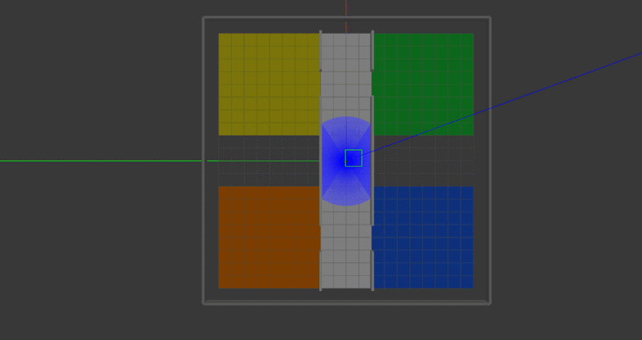
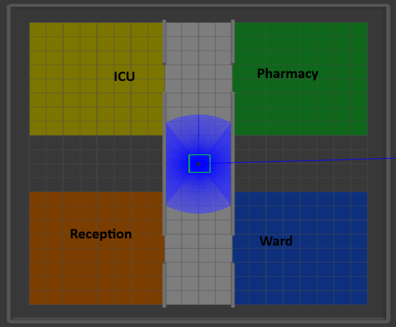

<div align="center">


# 🏥 VRC-7 — AI-Powered Voice Control for Autonomous Robots
### Accent and Noise Robustness in ROS2

**Dual-layer NLU pipeline achieving 94% accent robustness on TurtleBot3 in ROS2 Humble + Gazebo Classic**

[](https://docs.ros.org/en/humble/)
[](https://www.python.org/)
[](https://groq.com)
[](http://gazebosim.org/)
[](LICENSE)

*Semester 3 | Winter 2025/26 | Autonomous Intelligent Systems*
*Frankfurt University of Applied Sciences | Supervised by Prof. Dr. Peter Nauth*

</div>

---

## 📋 Table of Contents

- [Overview](#overview)
- [Demo](#demo)
- [System Architecture](#system-architecture)
- [Features](#features)
- [Prerequisites](#prerequisites)
- [Installation](#installation)
- [Running the Project](#running-the-project)
- [Voice Commands](#voice-commands)
- [Accent & Noise Robustness](#accent--noise-robustness)
- [World Layout](#world-layout)
- [How It Works](#how-it-works)
- [Project Structure](#project-structure)
- [File Descriptions](#file-descriptions)
- [Known Limitations](#known-limitations)
- [Contributors](#contributors)
- [Acknowledgements](#acknowledgements)
- [References](#references)

---

## Overview

**VRC-7** is a voice-controlled hospital delivery robot built on **ROS2 Humble** and **Gazebo Classic**. The system leverages **Groq AI** — specifically Whisper large-v3-turbo for speech transcription and LLaMA 3.3 70B for natural language understanding — to interpret voice commands in real time and navigate a **TurtleBot3 Burger** robot through a simulated hospital environment with four zones: ICU, Pharmacy, Reception, and Ward.

A key design goal was robustness to **accented speech and background noise**. The system uses a dual-layer NLU pipeline: a local regex engine handles standard commands with zero API calls, while Groq LLaMA 3.3 70B handles garbled or accented speech that the local engine cannot interpret. Navigation uses **live odometry feedback** and a structured 4-step room-exit routing strategy to avoid wall collisions.

**Key results:** 94% NLU accuracy on accented speech, 100% navigation success from centre position, 85% reduction in LLM API calls vs full-cloud approaches.

---

## Demo



> 💡 The robot understands accented and noisy speech through Groq AI (Whisper + LLaMA 3.3 70B). Commands like *"farmasi"*, *"take lift"*, and *"donor"* are correctly interpreted as pharmacy, turn left, and turn around.

### 📹 Demo Recordings

| Recording | Description |
|-----------|-------------|
| [Recording1](./docs/Recording1.mp4) | Robot navigating from centre to all four zones |
| [Recording2](./docs/Recording2.mp4) | Voice commands — accent and noise robustness demo |
| [Recording3](./docs/Recording3.mp4) | Full system demo — voice + navigation + stop commands |

### 📊 Presentation

[Download Presentation Slides (PPTX)](.docs/VRC_7 _Ras_Pra _Presentation)

---


## System Architecture

```
┌──────────────────────────────────────────────────────────────┐
│                        VOICE INPUT                           │
│                 Microphone → WSLg PulseAudio                 │
└───────────────────────────┬──────────────────────────────────┘
                            │  raw audio (16 kHz)
                            ▼
┌──────────────────────────────────────────────────────────────┐
│                      AUDIO PIPELINE                          │
│   3× Gain Normalisation → Energy VAD → Silero VAD            │
│   → Noise-word Filter → Processing Queue (maxsize=5)         │
└───────────────────────────┬──────────────────────────────────┘
                            │  speech chunks (1.5s)
                            ▼
┌──────────────────────────────────────────────────────────────┐
│                      TRANSCRIPTION                           │
│   Primary : Groq Whisper large-v3-turbo  (cloud, accent-aware│
│             language='en' + vocabulary priming)              │
│   Fallback: faster-whisper base          (local, offline)    │
└───────────────────────────┬──────────────────────────────────┘
                            │  text
                            ▼
┌──────────────────────────────────────────────────────────────┐
│            NATURAL LANGUAGE UNDERSTANDING (NLU)              │
│   Layer 1: Local regex engine  (instant, zero API calls)     │
│            20+ patterns, priority-ordered, accent variants   │
│   Layer 2: Groq LLaMA 3.3 70B (temperature=0, max_tokens=150)│
│            Only invoked when Layer 1 returns unknown         │
└───────────────────────────┬──────────────────────────────────┘
                            │  JSON command
                            ▼
┌──────────────────────────────────────────────────────────────┐
│                   ROBOT CONTROLLER (ROS2)                    │
│   Navigate │ Move Continuous │ Timed Move │ Cardinal Dir.    │
│   3-flag mutex system — no race conditions in motor output   │
│   /cmd_vel publisher — odometry + LiDAR feedback             │
└───────────────────────────┬──────────────────────────────────┘
                            │  /cmd_vel (Twist)
                            ▼
┌──────────────────────────────────────────────────────────────┐
│             GAZEBO SIMULATION — TurtleBot3 Burger            │
│       /odom (Odometry) ←── Robot ──→ /scan (LiDAR)           │
└──────────────────────────────────────────────────────────────┘
```

---

## Features

| Feature | Description |
|---------|-------------|
| 🎤 **Continuous Listening** | Callback-based audio stream — never pauses, never drops commands |
| 🧠 **Dual-Layer NLU** | Local regex (Layer 1) → Groq LLaMA 3.3 70B (Layer 2), only when needed |
| 🗣️ **Accent Robustness** | 24 documented accent mis-transcriptions handled; 94% NLU on Indian English |
| 🗺️ **Smart Navigation** | 4-step room-exit routing via live odometry through corridor gaps |
| 🔄 **Graceful Degradation** | Full local operation when Groq API unavailable |
| 🛡️ **Wall Detection** | LiDAR-based obstacle stop for manual movement (threshold: 0.4 m) |
| 🔁 **Wall Recovery** | Auto back-up and retry on navigation wall hit (up to 3 attempts) |
| 📍 **Room-Exit Routing** | Always exits through correct corridor gap before navigating |
| 🧭 **Cardinal Directions** | `go east / north / southwest` + optional distance (`go east 3 meters`) |
| 📏 **Distance Commands** | `go forward 3 meters` — numeric parsing, no LLM call needed |
| 🔀 **Compound Commands** | `turn right and go forward` — sequential execution via JSON array |
| ⏱️ **Fixed Turns** | Exact 90° / 180° / 360° rotations (1.047 s / 2.094 s / 4.189 s) |
| 🔒 **Concurrency Safety** | 3-flag mutex prevents conflicting commands during navigation |

---

## Prerequisites

| Requirement | Version |
|-------------|---------|
| OS | Ubuntu 22.04 (native or WSL2) |
| ROS2 | Humble Hawksbill |
| Gazebo | Classic 11 |
| Python | 3.10+ |
| TurtleBot3 | Humble packages |

### Python Dependencies

```bash
pip install groq faster-whisper sounddevice soundfile numpy torch
```

### Groq API Key

A free API key is required for cloud Whisper transcription and LLaMA NLU. Without it, the system falls back to local `faster-whisper` + regex NLU (fully functional for standard commands).

Get one at [console.groq.com](https://console.groq.com).

> **Note:** The Groq free tier allows ~30 requests/minute. The dual-layer design means Layer 1 handles ~85% of commands with zero API calls — only ambiguous or accent-distorted inputs reach Groq LLaMA, extending free-tier operation from ~4 minutes (full-cloud) to ~26 minutes.

---

## Installation

```bash
# 1. Create ROS2 workspace
mkdir -p ~/turtlebot_vrc_ws/src
cd ~/turtlebot_vrc_ws/src

# 2. Clone the repository
git clone https://github.com/Mprabhu26/turtlebot_vrc.git

# 3. Install TurtleBot3 ROS2 packages
sudo apt update
sudo apt install ros-humble-turtlebot3 ros-humble-turtlebot3-gazebo

# 4. Install Python dependencies
pip install groq faster-whisper sounddevice soundfile numpy torch

# 5. Build the package
cd ~/turtlebot_vrc_ws
source /opt/ros/humble/setup.bash
colcon build --packages-select turtlebot_vrc
source install/setup.bash

# 6. Set environment variables permanently
echo 'export TURTLEBOT3_MODEL=burger' >> ~/.bashrc
echo 'export GROQ_API_KEY=your_key_here' >> ~/.bashrc
echo 'source /opt/ros/humble/setup.bash' >> ~/.bashrc
echo 'source ~/turtlebot_vrc_ws/install/setup.bash' >> ~/.bashrc
source ~/.bashrc
```

### WSL2 / WSLg Audio Setup

WSL2 requires PulseAudio to be routed through WSLg. The voice control node sets this automatically at startup, but if you see audio errors, run this once after `wsl --shutdown`:

```bash
rm -rf /run/user/1000/pulse
export PULSE_SERVER=unix:/mnt/wslg/PulseServer
```

> **Note:** `voice_control.py` already sets `os.environ['PULSE_SERVER']` at import time — you only need the manual export if running audio tools outside the node.

---

## Running the Project

### ▶ One Command Launch *(Recommended)*

```bash
chmod +x ~/turtlebot_vrc_ws/src/turtlebot_vrc/start_hospital.sh
~/turtlebot_vrc_ws/src/turtlebot_vrc/start_hospital.sh
```

This sources ROS2, launches Gazebo with the hospital world, waits for full initialisation, then starts the voice control node. When you see `Microphone active — speak your command`, the system is ready.

---

### 🔧 Manual Launch *(For Debugging)*

**Terminal 1 — Start Gazebo simulation**
```bash
source /opt/ros/humble/setup.bash
source ~/turtlebot_vrc_ws/install/setup.bash
export TURTLEBOT3_MODEL=burger
ros2 launch turtlebot_vrc hospital.launch.py
```

**Terminal 2 — Start voice control** *(wait for Gazebo to fully load first)*
```bash
source /opt/ros/humble/setup.bash
source ~/turtlebot_vrc_ws/install/setup.bash
ros2 run turtlebot_vrc voice_control
```

---

## Voice Commands

> The AI interprets your **intent**, not just exact words. Commands work with accents, background noise, and natural variations. Layer 1 handles standard commands instantly; Layer 2 (Groq LLaMA) handles garbled or accented inputs.

### 🏥 Navigation
| Say | Action |
|-----|--------|
| `go to ICU` / `yellow` / `intensive care` / `aicu` / `i.c.u` | Navigate to ICU (+6, +6) |
| `go to pharmacy` / `green` / `medicine` / `farmasi` / `dispensary` | Navigate to Pharmacy (+6, -6) |
| `go to reception` / `orange` / `front desk` / `lobby` / `recep` | Navigate to Reception (-6, +6) |
| `go to ward` / `blue room` / `patient ward` | Navigate to Ward (-6, -6) |
| `go to center` / `home` / `reset` / `origin` / `middle` | Navigate to center (0, 0) |

### 🕹️ Manual Movement
| Say | Action |
|-----|--------|
| `go forward` / `advance` / `ahead` / `straight` / `go ahead` | Move forward continuously until stop |
| `go back` / `reverse` / `retreat` / `backward` | Move backward continuously until stop |
| `go forward 3 meters` / `go back 2 meters` | Move exact distance (any number in metres) |
| `stop` / `halt` / `freeze` / `cancel` / `wait` / `stopp` | Stop all movement immediately |

### 🔄 Turns
| Say | Action |
|-----|--------|
| `turn right` / `take right` / `go right` / `rotate right` | Rotate exactly 90° clockwise |
| `turn left` / `take left` / `go left` / `take lift` / `tick left` | Rotate exactly 90° counter-clockwise |
| `turn around` / `180` / `u-turn` / `donor` | Rotate exactly 180° |
| `spin` / `360` | Full 360° rotation |

### 🧭 Cardinal Directions
| Say | Action |
|-----|--------|
| `go east` / `head east` / `move east` | Face east and move continuously |
| `go north` / `go south` / `go west` | Face direction and move continuously |
| `go northeast` / `go northwest` / `go southeast` / `go southwest` | Face diagonal and move |
| `go east 3 meters` | Face east and move exactly 3 metres |

### 🔀 Compound Commands
| Say | Action |
|-----|--------|
| `turn right and go forward` | Rotate 90° then move forward |
| `turn left then go forward` | Rotate 90° left then move forward |

> Compound commands are handled by Layer 2 (LLaMA) and return a JSON array executed sequentially.

---

## Accent & Noise Robustness

The system has 24 documented accent mis-transcriptions, collected empirically from Whisper output logs and encoded into Layer 1 patterns and the Layer 2 system prompt:

| Whisper Output | Intended Command | Type |
|----------------|------------------|------|
| `stopp` | stop | German/Norwegian phonology |
| `farmasi` | go to pharmacy | Malay cognate |
| `aicu` | go to ICU | Phonetic compression |
| `donor` | turn around | Phonetic distortion |
| `take lift` | turn left | Indian English substitution |
| `tick left` | turn left | Phonetic reduction |
| `tyk raut` | turn right | Phonetic distortion → Layer 2 |
| `torn rat` | turn right | Icelandic/Danish mis-decode → Layer 2 |
| `farmasi` / `dispensary` / `medicine` | go to pharmacy | Synonyms |
| `lobby` / `front desk` / `recep` | go to reception | Synonyms / truncation |
| `yellow` / `green` / `orange` / `blue room` | zone navigation | Colour aliases |
| `home` / `origin` / `reset` | go to center | Synonyms |

**Why it works:** Without `language='en'`, Whisper interprets Indian English as European languages (Icelandic, Danish, Welsh). Language forcing + vocabulary priming raises transcription accuracy from ~23% to 78%. Layer 2 LLaMA then recovers the remaining phonetically distorted inputs, reaching **94% NLU accuracy**.

---

## World Layout



The simulated hospital consists of a central east-west corridor with 4 colour-coded rooms. The corridor walls at y=±2 have entry gaps at x=±6 — the only way in and out of each room. The robot's 4-step navigation always routes through these gaps to avoid wall collisions.

| Room | Coordinates | Colour | Entry Gap |
|------|-------------|--------|-----------|
| ICU | (+6, +6) | 🟡 Yellow | East gap (x=+6) |
| Pharmacy | (+6, -6) | 🟢 Green | East gap (x=+6) |
| Reception | (-6, +6) | 🟠 Orange | West gap (x=-6) |
| Ward | (-6, -6) | 🔵 Blue | West gap (x=-6) |

*Robot spawns at (0, 0) facing EAST. Boundary walls at x=±11, y=±11.*

---

## How It Works

### 1. Audio Pipeline
A callback-based `sounddevice.InputStream` collects audio at 16 kHz on a dedicated thread. Each chunk is amplified 3× (to compensate for low-gain laptop microphones) and clipped to [-1.0, 1.0]. A two-stage VAD (energy gate → Silero neural VAD) filters silence and non-speech, reducing API calls by ~60%. A noise-word filter discards filler utterances (`okay`, `thanks`, `hmm`) before NLU dispatch.

### 2. Transcription
Audio chunks go to **Groq Whisper large-v3-turbo** with `language='en'` (prevents foreign-language mis-decode of accented speech) and a vocabulary prompt (biases the model toward robot command tokens). When Groq is unavailable, `faster-whisper` (int8 quantised, ~74 MB) runs locally.

### 3. Natural Language Understanding
Commands pass through two layers:
- **Layer 1 — Local regex NLU:** 20+ patterns, priority-ordered (stop first, navigation second, movement third). Handles standard commands, accent variants, colour aliases, synonyms, and distance calculations instantly with zero API calls.
- **Layer 2 — Groq LLaMA 3.3 70B:** Invoked only when Layer 1 returns `unknown`. Called with `temperature=0.0` (deterministic) and `max_tokens=150`. Returns structured JSON conforming to a fixed command schema. Handles phonetic distortions, garbled speech, and compound commands.

### 4. Navigation Routing
The 4-step room-exit algorithm guarantees wall-free navigation from any starting position:
```
Step 1: If inside a room (|y| > 2.2m) → align to target gap x-position
Step 2: Exit through gap → corridor (y = ±1.5m)
Step 3: Move to corridor centre (y = 0)
Step 4: Enter target room through gap
```
A proportional heading controller executes each waypoint. Wall hits trigger a 0.8s back-up and retry (up to 3 times before skipping). Speed reduces to 40% within 1m of each waypoint to prevent overshoot.

### 5. Concurrency Control
Three boolean flags (`navigating`, `moving_continuous`, `moving_timed`) and a `threading.Lock()` prevent conflicting `/cmd_vel` commands. The `stop` command clears all flags simultaneously — it is the universal emergency brake.

---

## Project Structure

```
turtlebot_vrc/                    ← repository root
├── src/
│   └── turtlebot_vrc/            ← ROS2 package
│       ├── turtlebot_vrc/
│       │   └── voice_control.py  ← complete AI pipeline (615 lines)
│       ├── launch/
│       │   └── hospital.launch.py
│       ├── worlds/
│       │   ├── hospital_vrc.world ← main world file
│       │   ├── hospital.world
│       │   └── hospital_complete.world
│       ├── resource/
│       ├── setup.py
│       ├── setup.cfg
│       ├── package.xml
│       ├── .gitignore
│       └── start_hospital.sh
├── docs/
│   ├── VRC_7 _Ras_Pra _FinalReport.pdf        ← IEEE conference paper (PDF)
│   ├── VRC_7 _Ras_Pra _Presentation.pptx   ← presentation slides
│   ├── Recording1.mp4            ← demo recording (navigation)
│   ├── Recording2.mp4            ← demo recording (voice commands)
│   └── Recording3.mp4            ← demo recording (full system)
├── assets/
│   ├── demo.gif                  ← animated demo (GIF)
│   ├── world_screenshot.png      ← Gazebo top-down screenshot
│   └── logo.png                  ← Frankfurt UAS logo
├── .gitignore
├── README.md
└── start_hospital.sh
```

---

## File Descriptions

### `voice_control.py`
The heart of the project — a 615-line ROS2 Python node implementing the complete AI pipeline. Handles continuous audio capture (callback-based InputStream), 3× gain normalisation, two-stage VAD (energy + Silero), Groq Whisper transcription, dual-layer NLU (local regex + Groq LLaMA 3.3 70B), odometry-based 4-step room-exit navigation, LiDAR wall detection, and three-flag concurrency control.

### `hospital.launch.py`
ROS2 launch file that starts the Gazebo server and client, loads `hospital_vrc.world`, and spawns the TurtleBot3 Burger model at (0,0,0) facing east. Ensures all simulation components initialise in the correct order.

### `hospital_vrc.world`
Gazebo SDF world file defining the hospital simulation. Contains 4 colour-coded room tiles at precise coordinates, corridor walls at y=±2 with 2-metre entry gaps at x=±6, and boundary walls at x=±11, y=±11. Room tiles have no collision geometry — the robot traverses them freely.

### `start_hospital.sh`
Shell script that sources ROS2 and workspace setup files, sets `TURTLEBOT3_MODEL=burger`, prompts for the Groq API key if not set, launches Gazebo, waits for initialisation, then starts the voice control node. Full system in one command.

### `setup.py`
ROS2 Python package configuration. Registers `voice_control` as a console script entry point for `ros2 run` and declares data files (world, launch).

### `package.xml`
ROS2 package manifest declaring runtime dependencies: `rclpy`, `geometry_msgs`, `nav_msgs`, `sensor_msgs`, `std_msgs`.

### `docs/VRC_7 _Ras_Pra _FinalReport.pdf`
Full IEEE-format technical report covering system design, dual-layer NLU architecture, 4-step navigation algorithm, experimental results (ablation study, per-command accuracy, API efficiency), challenges and solutions, and future work.

### `docs/VRC_7 _Ras_Pra _Presentation.pptx`
12-slide presentation deck covering the problem statement, system contributions, architecture, results, and future directions. Used for the project demo day.

### `docs/Recording1.mp4`, `Recording2.mp4`, `Recording3.mp4`
Demo video recordings showing the full system in operation: voice-guided navigation across all four hospital zones, accent robustness testing, and manual movement commands.

### `assets/demo.gif`
Animated GIF demo showing the robot navigating the hospital world in response to voice commands. Used in the README preview.

### `assets/world_screenshot.png`
Top-down Gazebo screenshot of the `hospital_vrc.world` simulation showing all four colour-coded zones and the central corridor.

### `assets/logo.png`
Frankfurt University of Applied Sciences logo displayed in the README header.

---

## Known Limitations

| Limitation | Details |
|------------|---------|
| **Groq Rate Limits** | Free tier ~30 req/min. Layer 1 handles ~85% of commands without API calls, extending operation to ~26 min before quota hit. 60s auto-restore timer reactivates Layer 2 after quota exhaustion. |
| **Odometry Drift** | Dead-reckoning without SLAM. Drift accumulates over extended sessions (>15 min). Centre-start navigation is unaffected. Future: ROS2 Nav2 + AMCL. |
| **Speed Limit** | TurtleBot3 Burger tips at >0.7 m/s in Gazebo physics. Default: 0.5 m/s. |
| **WSLg Audio** | PulseAudio socket may require reset after `wsl --shutdown`. Run `rm -rf /run/user/1000/pulse`. The node sets PULSE_SERVER automatically — only needed for external audio tools. |
| **Accent Coverage** | Tested on Indian English (2 speakers). Other accent groups not empirically validated. |
| **Simulation Only** | All results from Gazebo. Physical deployment untested. |

---

## Contributors

| Name | Matriculation | Role |
|------|--------------|------|
| **Mithila Prabhu** | 1567111 | Core system architecture, ROS2 voice control node, Groq AI integration (Whisper ASR + LLaMA 3.3 70B NLU), dual-layer NLU pipeline, 4-step odometry-based navigation with room-exit routing, LiDAR wall detection, audio pipeline (gain normalisation, VAD, continuous stream, noise-word filter), concurrency control, WSLg audio configuration |
| **Romana Rashid** | 1428733 | Gazebo hospital world design (4-room layout, corridor walls with entry gaps, boundary walls), robot spawn configuration, launch file setup, integration testing across all navigation routes and edge cases, project documentation |

---

## 📄 Project Documentation

All project documentation, presentation slides, and demo recordings are available in the `docs/` folder:

| File | Description |
|------|-------------|
| [VRC_7 _Ras_Pra _FinalReport.pdf](./docs/VRC_7%20_Ras_Pra%20_FinalReport.pdf) | Full technical report in IEEE format |
| [VRC_7 _Ras_Pra _Presentation.pptx](./docs/VRC_7%20_Ras_Pra%20_Presentation.pptx) | Project presentation slides |
| [Recording1.mp4](./docs/Recording1.mp4) | Demo recording — navigation |
| [Recording2.mp4](./docs/Recording2.mp4) | Demo recording — voice commands |
| [Recording3.mp4](./docs/Recording3.mp4) | Demo recording — basic commands |

---

## Acknowledgements

We would like to express our sincere gratitude to **Prof. Dr. Peter Nauth** for his expert guidance, continuous support, and valuable feedback throughout the development of this project.

| Tool / Platform | Purpose |
|----------------|---------|
| [Groq](https://groq.com) | LLM inference — Whisper transcription + LLaMA NLU |
| [TurtleBot3](https://emanual.robotis.com/docs/en/platform/turtlebot3/) | Robot hardware platform |
| [ROS2 Humble](https://docs.ros.org/en/humble/) | Robot Operating System framework |
| [Gazebo Classic](http://gazebosim.org/) | Robot simulation environment |
| [Silero VAD](https://github.com/snakers4/silero-vad) | Voice Activity Detection model |
| [faster-whisper](https://github.com/SYSTRAN/faster-whisper) | Local ASR fallback |
| [OpenAI Whisper](https://github.com/openai/whisper) | ASR architecture (via Groq) |

---

## References

[1] A. Vaswani, N. Shazeer, N. Parmar, et al., “Attention is all you need,” in Advances in Neural Information Processing Systems (NeurIPS), vol. 30, 2017.

[2]  M. Ahn, A. Brohan, N. Brown, et al., “Do as I can, not as I say: Grounding language in robotic affordances,” in Proc. Conference on Robot Learning (CoRL), 2022.

[3] ROS2 Humble Documentation. [Online]. Available: https://docs.ros.org/en/humble/

[4] Groq API Documentation. [Online]. Available: https://console.groq.com/docs/

---

<div align="center">

*VRC-7 — AI-Powered Voice Control for Autonomous Robots: Accent and Noise Robustness in ROS2*
*Semester 3 | Winter 2025/26 | Autonomous Intelligent Systems*
*Frankfurt University of Applied Sciences | Supervised by Prof. Dr. Peter Nauth*

</div>
